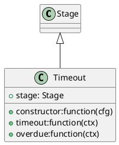

```uml
@startuml

	Class Stage
	Class Timeout {
		+constructor:function(cfg)
		+timeout:function(ctx)
		+overdue:function(ctx)
		+stage: Stage
	}
 	Stage <|-- Timeout

@enduml
```



@startuml

	Class Stage
	Class Timeout {
		+constructor:function(cfg)
		+timeout:function(ctx)
		+overdue:function(ctx)
		+stage: Stage
	}
 	Stage &lt;|-- Timeout

@enduml
